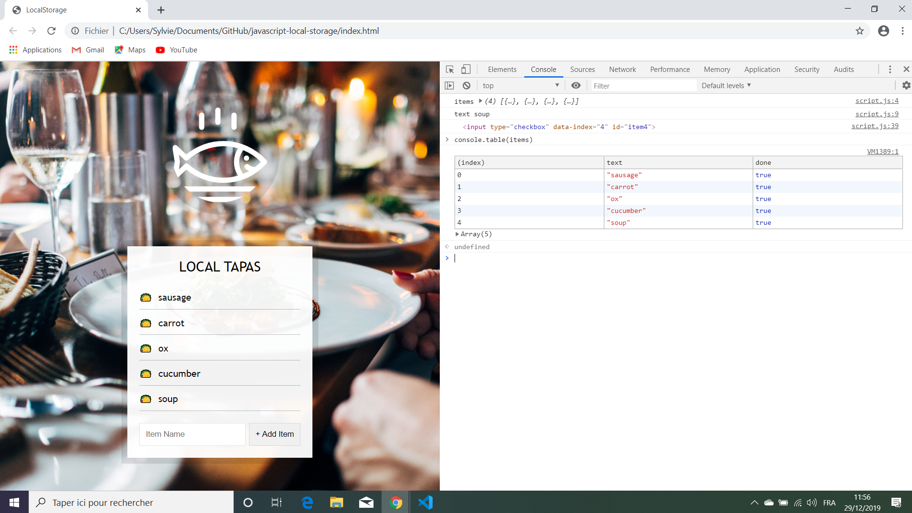

# :zap: Javascript30 Local Storage

* Wes Bos Youtube Tutorial: [How LocalStorage and Event Delegation work. #JavaScript30 15/30](https://www.youtube.com/watch?v=YL1F4dCUlLc&index=15&list=PLu8EoSxDXHP6CGK4YVJhL_VWetA865GOH).
* **Note:** to open web links in a new window use: _ctrl+click on link_


## :page_facing_up: Table of contents

* [:zap: Javascript30 Local Storage](#zap-javascript30-local-storage)
  * [:page_facing_up: Table of contents](#page_facing_up-table-of-contents)
  * [:books: General info](#books-general-info)
  * [:camera: Screenshots](#camera-screenshots)
  * [:signal_strength: Technologies](#signal_strength-technologies)
  * [:floppy_disk: Setup](#floppy_disk-setup)
  * [:computer: Code Examples](#computer-code-examples)
  * [:cool: Features](#cool-features)
  * [:clipboard: Status & To-Do List](#clipboard-status--to-do-list)
  * [:clap: Inspiration](#clap-inspiration)
  * [:file_folder: License](#file_folder-license)
  * [:envelope: Contact](#envelope-contact)

## :books: General info

* Tutorial using a restaurant menu list to explain how HTML local storage works using key-value strings.

## :camera: Screenshots

.

## :signal_strength: Technologies

* [Javascript v1.9 ECMA-262 ECMAScript 2020](http://www.ecma-international.org/publications/standards/Ecma-262.htm)
* [HTML local storage](https://developer.mozilla.org/en-US/docs/Web/API/Window/localStorage)

## :floppy_disk: Setup

* Open index.html in browser. If any code is changed the browser needs to be refreshed.

## :computer: Code Examples

* Code to add item to local storage

```javascript
function addItem(e) {
  e.preventDefault(); // prevent the browser from performing the default action for that element (page refresh).
  const text = (this.querySelector('[name=item]')).value;
  console.log('text', text); // example text: text lettuce
  const item = {
    text,
    done: false
  };

  items.push(item);
  populateList(items, itemsList); //run this function to add items to the plates list.

  // add to local storage using setItem and JSON.stringify to change object to a string.
  localStorage.setItem('items', JSON.stringify(items));
  this.reset();
}
```

## :cool: Features

* Uses HTML local storage so items not lost in the event of a page refresh etc.

## :clipboard: Status & To-Do List

* Status: Working.
* To-Do: This code can be enhanced with an option to set as 'done' or clear all items in the plates list.

## :clap: Inspiration

* Wes Bos Youtube Tutorial: [How LocalStorage and Event Delegation work. #JavaScript30 15/30](https://www.youtube.com/watch?v=YL1F4dCUlLc&index=15&list=PLu8EoSxDXHP6CGK4YVJhL_VWetA865GOH)

## :file_folder: License

* N/A

## :envelope: Contact

* Repo created by [ABateman](https://github.com/AndrewJBateman), email: gomezbateman@yahoo.com
